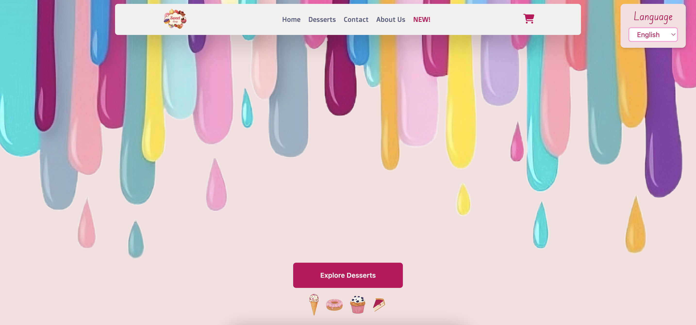
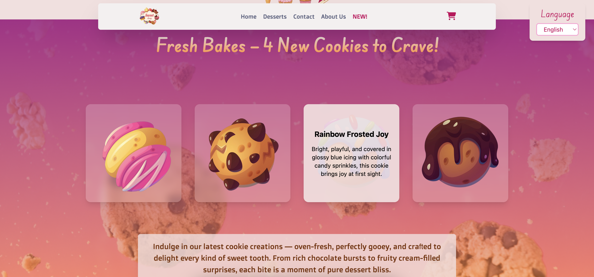
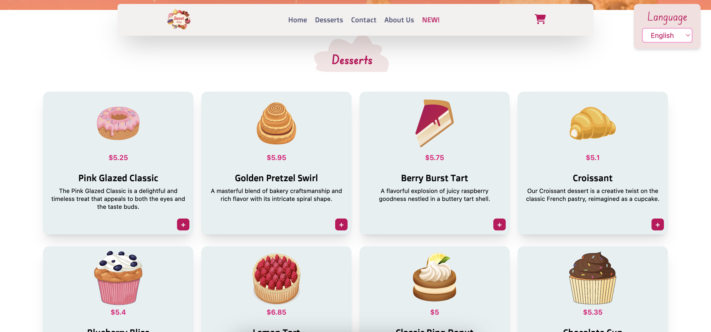
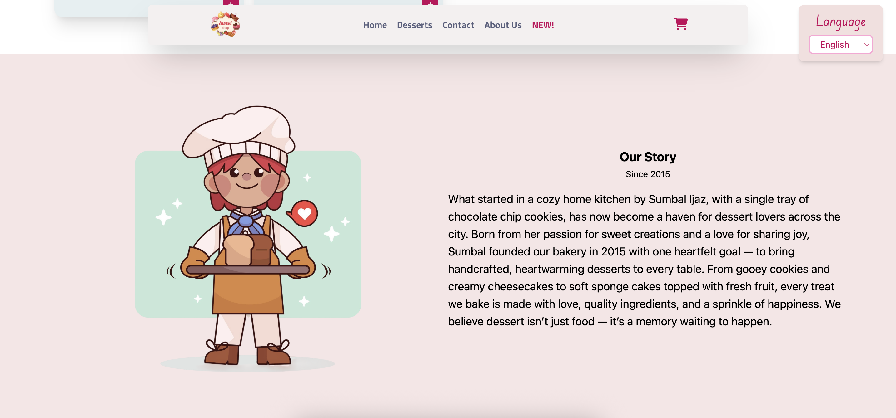
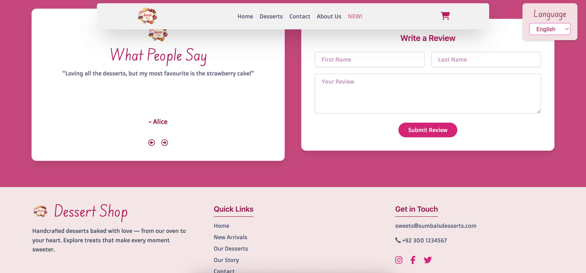

# 🍰 Dessert Shop

A beautiful, multilingual dessert website built with **React**, **Redux Toolkit**, and **Tailwind CSS**. Explore a sweet collection of desserts with smooth animations, responsive design, and support for English, French, and German languages.

👉 **Live Demo**: [https://dessert-shop-641cc.web.app/](https://dessert-shop-641cc.web.app/)  
👉 **GitHub Repo**: [https://github.com/summbal122/Dessert-Shop](https://github.com/summbal122/Dessert-Shop)

---

## ✨ Features

- 🧁 Multilingual (EN, FR, DE)  
- 🎨 Responsive UI with Tailwind CSS  
- ⚙️ State management with Redux Toolkit  
- 🚀 Hosted on Firebase  
- 📱 Mobile-friendly design  

---

## 📸 Previews

  
  
  
  
  

---

## 🛠 Tech Stack

- **React**  
- **Redux Toolkit**  
- **Tailwind CSS**  
- **Framer Motion**  
- **Firebase Hosting**  
- **Lucide Icons**  

---

## 🚀 Getting Started

### Prerequisites

- Node.js (v14+) and npm installed

### Installation

```bash
git clone https://github.com/summbal122/Dessert-Shop.git
cd Dessert-Shop
npm install
npm start
```

---

## 👩‍💻 Author

**Sumbal Ijaz**  
Frontend Developer — React | Redux | Tailwind CSS  
🔗 [LinkedIn](https://www.linkedin.com/in/sumbal-ijaz-90047925b/)  
💻 [GitHub](https://github.com/summbal122)  